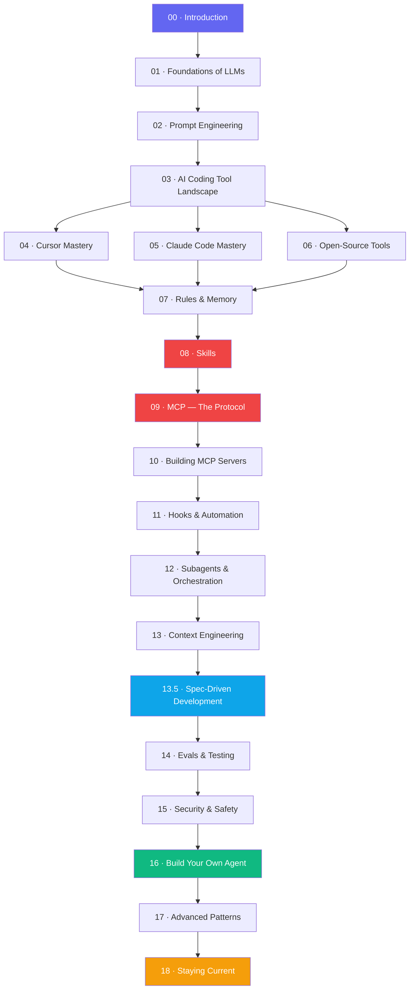

<div align="center">

# 🤖 The Agentic Coding Roadmap

### Learn how to build software *with* AI agents — from zero to pro.

A free, open-source, step-by-step roadmap that takes you from *"I type prompts into Cursor"*
to *"I design, build, and ship production agent systems."*


[**Start Learning →**](./steps/00-introduction.md) &nbsp;·&nbsp; [Roadmap](./ROADMAP.md) &nbsp;·&nbsp; [Resources](./resources) &nbsp;·&nbsp; [Projects](./projects/practice-projects.md) &nbsp;·&nbsp; [Contribute](./CONTRIBUTING.md)

</div>

---

## 👋 Who this is for

You already know basic programming (variables, loops, functions, git). You use **Cursor**, **Claude Code**, **Qwen CLI**, **GitHub Copilot**, or similar — but you feel there's a whole iceberg under the surface: **MCP, Skills, Rules, Hooks, Subagents, Context Engineering, Evals…**

This roadmap is that iceberg, mapped.

> **Time commitment:** ~30–45 hours of focused learning. Do 1 step/day for 3 weeks, or 1 step/week for a calm pace.

---

## 🗺️ The roadmap at a glance



---

## 📚 The 20 steps

| #  | Step | Focus | Est. time |
|----|------|-------|-----------|
| 00 | [Introduction to Agentic Coding](./steps/00-introduction.md) | What & why | 30 min |
| 01 | [Foundations of LLMs](./steps/01-foundations.md) | Tokens, context, models | 2 h |
| 02 | [Prompt Engineering for Coders](./steps/02-prompt-engineering.md) | Writing prompts that work | 2 h |
| 03 | [The AI Coding Tool Landscape](./steps/03-ai-coding-tools.md) | Pick your stack | 1 h |
| 04 | [Cursor Mastery](./steps/04-cursor-mastery.md) | IDE-native agent | 3 h |
| 05 | [Claude Code Mastery](./steps/05-claude-code-mastery.md) | CLI-native agent | 3 h |
| 06 | [Open-Source CLIs](./steps/06-open-source-tools.md) | Aider, Cline, Continue, Qwen | 2 h |
| 07 | [Rules & Memory](./steps/07-rules-and-memory.md) | Persistent agent guidance | 2 h |
| 08 | [Skills](./steps/08-skills.md) | Reusable agent abilities | 2 h |
| 09 | [MCP — Introduction](./steps/09-mcp-introduction.md) | The "USB-C of AI" | 2 h |
| 10 | [Building MCP Servers](./steps/10-mcp-building-servers.md) | Ship your first server | 4 h |
| 11 | [Hooks & Automation](./steps/11-hooks-automation.md) | Pre/post agent loops | 2 h |
| 12 | [Subagents & Orchestration](./steps/12-subagents-orchestration.md) | Multi-agent teams | 3 h |
| 13 | [Context Engineering](./steps/13-context-engineering.md) | The 2026 breakout skill | 3 h |
| 13.5 | [Spec-Driven Development](./steps/13.5-spec-driven-development.md) | GitHub Spec Kit + OpenSpec; Specify → Plan → Implement | 2 h |
| 14 | [Evals & Testing](./steps/14-evals-testing.md) | Measure agent quality | 2 h |
| 15 | [Security & Safety](./steps/15-security-safety.md) | Don't get pwned | 2 h |
| 16 | [Build Your Own Agent](./steps/16-build-your-own-agent.md) | From scratch with SDKs | 4 h |
| 17 | [Advanced Patterns](./steps/17-advanced-patterns.md) | Swarms, routers, reflection | 3 h |
| 18 | [Staying Current](./steps/18-staying-current.md) | Never fall behind | ongoing |

---

## 🎯 How to use this roadmap

1. **Don't skip.** Each step assumes the previous one. Even "obvious" steps contain nuggets.
2. **Do the hands-on exercises.** Reading alone won't build skill — you must *ship*.
3. **Keep a `learning-log.md`.** For every step, write 3 bullet points: *what I learned · what confused me · what I'll try next*.
4. **Build in public.** Post your exercises on Twitter/X or GitHub. This 10x's retention (and sometimes lands jobs).
5. **Contribute back.** Found a broken link or a better resource? [Open a PR](./CONTRIBUTING.md).

---

## 📦 What's inside this repo

```
.
├── README.md                ← You are here
├── ROADMAP.md               ← The visual learning path
├── CONTRIBUTING.md          ← How to improve this roadmap
├── steps/                   ← The 20 numbered learning modules (includes 13.5)
├── resources/               ← Curated YouTube, GitHub, books, communities
└── projects/                ← Hands-on portfolio projects
```

---

## 🔥 The big picture: 6 ideas that will save you months

Before you dive in, internalize these. Everything else is commentary.

1. **Agents are just LLMs in a loop with tools.** Strip the mystique. An agent = `while not done: llm.pick_a_tool(); run_tool(); feed_result_back()`.
2. **Context is the product.** What you *put into* the context window matters more than the model or the prompt. This is why "context engineering" is *the* skill.
3. **MCP is the USB-C of AI.** One standard. Any client (Cursor, Claude, Copilot) can plug into any server (GitHub, Postgres, your internal API).
4. **Skills > Prompts > Rules, for scale.** Prompts are per-task. Rules are per-repo. Skills are per-capability and travel with you.
5. **Evals beat vibes.** "It felt better" is not a shipping criterion. Write evals early. Your future self will thank you.
6. **Spec is the source of truth.** In the Spec-Driven Development era, you write the spec first; the agent generates the code. Code is the build artifact — the spec is what you maintain.

---

## 🌟 What makes this roadmap different

- ✅ **Tool-agnostic.** We cover Cursor, Claude Code, Qwen, Aider, Cline, Continue, Copilot.
- ✅ **2026-current.** MCP, Skills, Hooks, Subagents — the stuff that didn't exist 12 months ago.
- ✅ **Free & open-source.** No course paywall. Every link is a YouTube video, docs page, or GitHub repo.
- ✅ **Hands-on.** Every step ends with an exercise you can finish in under an hour.
- ✅ **Maintained.** The AI tooling space moves weekly. We keep this current — [see CONTRIBUTING](./CONTRIBUTING.md).

---

## 🚀 Ready? Start here.

<div align="center">

### [→ Step 00: Introduction to Agentic Coding](./steps/00-introduction.md)

</div>

---

## 💛 Support

If this roadmap helped you, the best thanks is:

1. **⭐ Star this repo** — it helps other learners find it.
2. **Share it on Twitter/X or LinkedIn** with `#AgenticCoding`.
3. **[Open a PR](./CONTRIBUTING.md)** with something you wish was here.

---

<div align="center">

Made with 🤖 + ☕ for the next generation of AI-native builders.
MIT Licensed — fork it, remix it, teach it.

</div>
