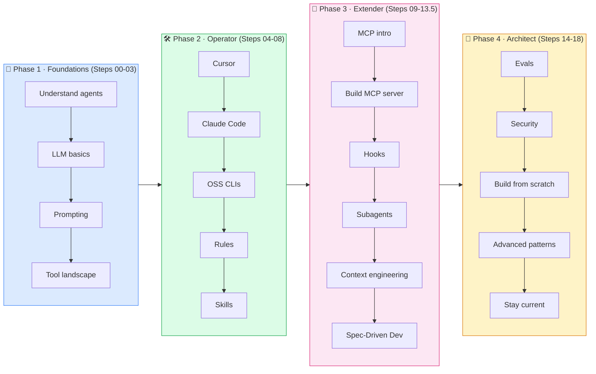
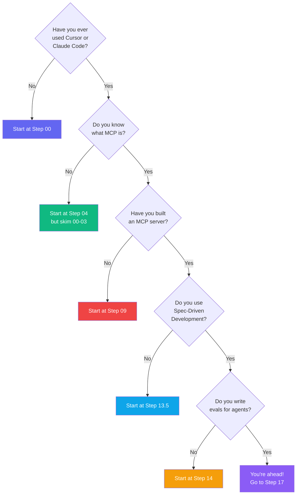

# 🗺️ The Visual Roadmap

> A one-page big picture. Print it, screenshot it, put it on your desk.

---

## The 4 learning phases



---

## Skill progression

| Phase | After this phase you can… |
|-------|----------------------------|
| **🌱 Foundations** | Explain what an agent is, pick a tool, write prompts that don't waste tokens. |
| **🛠️ Operator** | Use Cursor & Claude Code at near-expert level. Configure rules and skills that make you 2-5x faster. |
| **🔌 Extender** | Plug agents into any data source via MCP. Automate pre/post-agent steps with hooks. Run multi-agent workflows. Drive features from specs (GitHub Spec Kit). |
| **🧠 Architect** | Write evals, harden for production, build agents from scratch with the SDK, design multi-agent systems. |

---

## Decision tree: *where should I start?*



---

## The 3-week plan

> Work through the roadmap on a sustainable schedule.

### Week 1 — Foundations & Operator
| Day | Steps | Outcome |
|-----|-------|---------|
| Mon | 00, 01 | Know the vocabulary |
| Tue | 02 | Write better prompts immediately |
| Wed | 03, 04 | Cursor configured for your workflow |
| Thu | 05 | Claude Code running in terminal |
| Fri | 06 | Try one OSS CLI (Aider or Cline) |
| Weekend | **Mini project:** refactor an old side-project using an agent end-to-end |

### Week 2 — Extender
| Day | Steps | Outcome |
|-----|-------|---------|
| Mon | 07 | `.cursor/rules/` and `AGENTS.md` set up |
| Tue | 08 | Your first custom skill |
| Wed | 09 | MCP big picture locked in |
| Thu | 10 | **Your own MCP server running** |
| Fri | 11 | Hooks running on every session |
| Weekend | **Mini project:** build an MCP server that connects Claude to a real API you use |

### Week 3 — Architect
| Day | Steps | Outcome |
|-----|-------|---------|
| Mon | 12 | Multi-agent delegation working |
| Tue | 13, 13.5 | Context engineering applied; spec-driven workflow running via GitHub Spec Kit |
| Wed | 14 | You have 10+ evals for your agent |
| Thu | 15 | Threat-modeled your agent setup |
| Fri | 16 | Agent-from-scratch in ~200 lines |
| Weekend | **Capstone:** ship a public agent on GitHub with README + evals + MCP server |

---

## Track your progress

Copy this into a `learning-log.md` in your own repo:

```markdown
- [ ] 00 · Introduction
- [ ] 01 · Foundations
- [ ] 02 · Prompt Engineering
- [ ] 03 · Tool Landscape
- [ ] 04 · Cursor Mastery
- [ ] 05 · Claude Code Mastery
- [ ] 06 · Open-Source Tools
- [ ] 07 · Rules & Memory
- [ ] 08 · Skills
- [ ] 09 · MCP Introduction
- [ ] 10 · Building MCP Servers
- [ ] 11 · Hooks & Automation
- [ ] 12 · Subagents & Orchestration
- [ ] 13 · Context Engineering
- [ ] 13.5 · Spec-Driven Development
- [ ] 14 · Evals & Testing
- [ ] 15 · Security & Safety
- [ ] 16 · Build Your Own Agent
- [ ] 17 · Advanced Patterns
- [ ] 18 · Staying Current
```

Post your completed check-list on Twitter/X with `#AgenticCoding` and tag the repo. 💪
