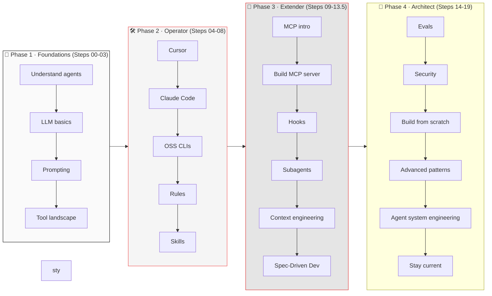

# Roadmap Agent Run Report

Task: Summarize roadmap

## Observations
```text
Step 1 / read_file
SUCCESS
# 🗺️ The Visual Roadmap

> A one-page big picture. Print it, screenshot it, put it on your desk.
>
> **Last verified: September 2026.** See [README.md](./README.md#-currency) for refresh guidance.

---

## The 4 learning phases



## Final Summary
This reference runtime demonstrates the core agent pattern:
1) maintain context state
2) choose a tool
3) execute safely
4) evaluate output
5) iterate until done