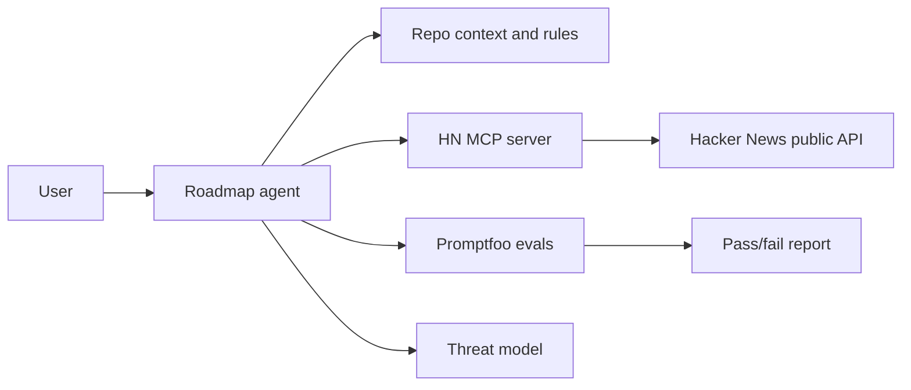

# Public Agent Capstone

This capstone packages a complete agentic engineering artifact in plain English: a small AI-assisted system that a reviewer can run, inspect, test, and trust.

## Problem statement

Build and publish a minimal public agent that proves you understand the full agentic coding loop: context, tools, evals, security, and human review.

It should be small enough to audit, but complete enough to show production-minded habits.

## What's included

- custom agent runtime (`agents/roadmap_agent.py`)
- MCP server with real API integration (`mcp/hn-context-server/server.js`)
- eval suite (`evals/promptfooconfig.yaml`)
- safety model (`security/threat-model.md`)
- persistent project context (`AGENTS.md`, `.cursor/rules/`, `.cursor/skills/`, hooks)

## Architecture



## Agent flow

- **Context strategy:** The agent reads repo guidance from `AGENTS.md`, selected roadmap files, and task-specific inputs instead of loading the whole repo by default.
- **Tool boundaries:** The sample MCP server is read-only and public-data only. Shell and file edits remain supervised by the human operator.
- **Eval criteria:** The eval suite checks whether explanations include correct industry terms, plain-English meanings, safety controls, and capstone proof.
- **HITL (human-in-the-loop):** A person must approve commits, publishing, destructive shell commands, and any future write-capable MCP tool.

## Capstone goals

1. Demonstrate end-to-end agent loop design.
2. Demonstrate MCP interoperability with a live API.
3. Demonstrate quality gates using evals.
4. Demonstrate security controls (least privilege + blocked dangerous shell patterns).

## Runbook

### 1) Run custom agent

```bash
python agents/roadmap_agent.py --task "Summarize roadmap" --max-steps 4
```

### 2) Check deterministic code gates

```bash
python -m py_compile agents/roadmap_agent.py scripts/check_docs.py
node --check mcp/hn-context-server/server.js
python scripts/check_docs.py
```

### 3) Run MCP server

```bash
node mcp/hn-context-server/server.js
```

The server is read-only, uses the public Hacker News API, and times out failed network calls instead of hanging forever.

### 4) Execute evals

```bash
promptfoo eval -c evals/promptfooconfig.yaml
```

If provider API keys are unavailable, record that eval execution was skipped and include the reason in your evidence section.

## Test plan

- [ ] Agent report file is generated.
- [ ] MCP server responds to `initialize`, `tools/list`, and `tools/call`.
- [ ] `python scripts/check_docs.py` passes.
- [ ] `python -m py_compile agents/roadmap_agent.py scripts/check_docs.py` passes.
- [ ] `node --check mcp/hn-context-server/server.js` passes.
- [ ] Eval suite runs with 10+ tests and reports pass/fail.
- [ ] Threat model reviewed and controls mapped to implementation.
- [ ] Human approval is required before publishing, committing, or enabling write-capable tools.

## Deliverable checklist

- [x] README with usage + test plan
- [x] Evals config
- [x] MCP server
- [x] Security/threat model
- [x] Learning log
- [ ] Evidence section with command output summaries or screenshots
- [ ] Short reflection: what worked, what failed, and what you would improve next

## Evidence template

Paste short summaries, not secrets or huge logs.

```text
Docs check: passed
Python compile: passed
Node syntax check: passed
MCP initialize/tools/list/tools/call: passed
Promptfoo evals: passed/failed/skipped because ...
Threat model review: completed by ...
```

## Security proof

- Secrets are not stored in tracked files.
- MCP server uses least privilege: public read-only API access only.
- Destructive actions require HITL approval.
- The threat model documents assets, trust boundaries, threats, controls, and abuse cases.
- CI uses least-privilege permissions and skips provider-backed evals when secrets are unavailable.

## What to improve next

After the capstone works, choose one small improvement:

- Add a contract test for the MCP tool response shape.
- Add trace logging for every agent step.
- Add a second read-only MCP tool.
- Add a scheduled eval run.
- Translate one step into your native language.

## Share template (X / Twitter)

Use the draft in `capstone/public-agent/x-post-draft.md`.
