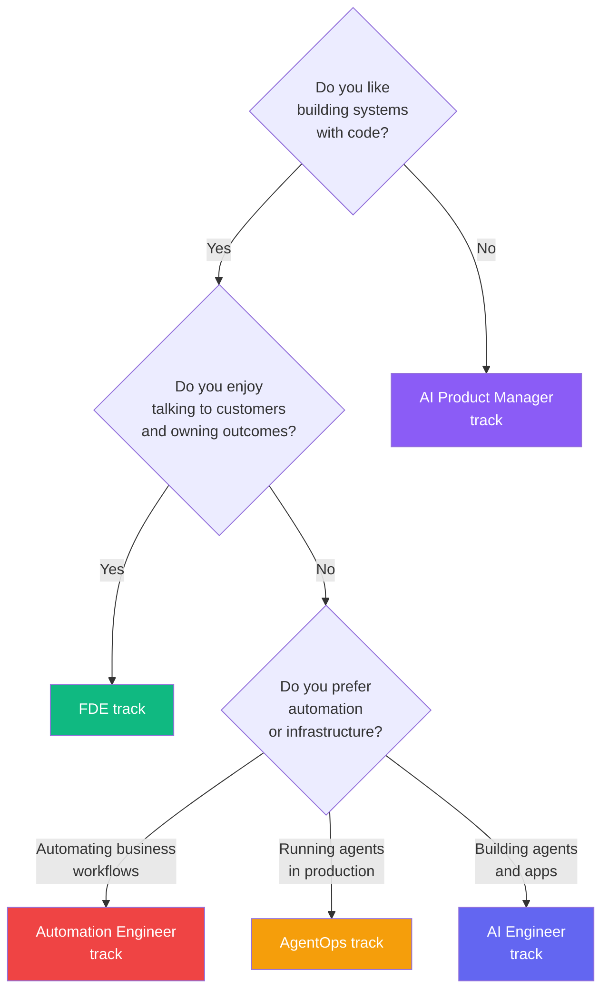

# 🧭 Role Tracks — Learn, Then Earn

> The 21 steps in `steps/` are the shared highway: everyone drives the same road. These role pages are the **exit signs** — they tell you which steps matter most for your target job, what to add on top, and what the market pays.

> **Last verified: August 2026.** Salaries and demand numbers move fast. Treat ranges as directional, check live job boards before committing to a target.

---

## 🎯 Why role tracks?

Most roadmaps teach skills in a vacuum. The market rewards **applied** skills: companies are hiring people who can *wire existing AI into products, automate workflows, deploy into customer environments, and run agents reliably* — not just people who know buzzwords.

Pick the role that matches **how you like to work**, follow its track, and ship the portfolio project at the end. Every role reuses the same 21 steps — you never learn something twice.

---

## 📊 The 2026–2027 market dashboard

Agentic AI job postings grew **280% year-over-year** to ~90,000 US listings (Stanford 2026 AI Index). Agentic AI Engineer roles grew **13x** and Forward Deployed Engineer roles grew **42x** over two years (LinkedIn hiring data, 2026).

| Role | 2026 demand signal | US salary (mid-level) | 2027 outlook | Track |
|---|---|---|---|---|
| **AI Engineer / Agent Developer** | #1 fastest-growing LinkedIn title (+143% postings) | $130K–$155K (senior $180K+) | Strongest growth continues | [Full track](./ai-engineer.md) |
| **Forward Deployed Engineer (FDE)** | +800% postings YoY; 42x role growth | $150K–$325K ($500K+ at labs) | Enterprise AI bottleneck | [Full track](./fde.md) |
| **Automation Engineer** | RPA → agentic shift; 60% of new enterprise projects have agentic components | $150K–$250K | Agents automate ~30% of knowledge work by 2027 | [Full track](./automation-engineer.md) |
| **AgentOps / Reliability Engineer** | New role family (2025–26); agentic postings +280% YoY | $185K–$320K | AgentOps becomes a standard enterprise function | [Full track](./agentops.md) |
| **ML Engineer (applied)** | WEF: AI/ML fastest-growing job by 2027 (~1M new jobs, +40%) | $140K–$170K (senior $200K+) | +40% growth by 2027 | [Adjacent](./ml-engineer.md) |
| **AI Product Manager** | Top-paying non-code path | $145K–$210K+ | Grows as AI goes strategic | [Adjacent](./ai-product-manager.md) |
| **Data Engineer** | #1 in recruiter search volume | $120K–$160K | Pipelines stay foundational | [Adjacent](./data-engineer.md) |
| **Prompt Engineer** | Exists but merging INTO AI Engineer | $110K–$135K | Standalone titles decline | [Adjacent](./prompt-engineer.md) |

Sources: Stanford AI Index 2026, WEF Future of Jobs, LinkedIn AI hiring data, Indeed Hiring Lab, SignalHire recruiter-search data, published salary surveys (Aug 2026).

---

## 🧭 Which role for me? (decision flow)

---

## 📋 How to use a role track

1. **Read the role page** — understand the job, the pay, the day-to-day.
2. **Follow the step order** on the page — core steps first (●), optional later (◐), skim last (○).
3. **Do the role-specific additions** — these close the gap between "knows steps" and "hireable."
4. **Ship the role capstone** — every page ends with a portfolio project. A hiring manager trusts shipped evidence over certificates.

---

## 📈 Learn-and-earn principles

- **Proof beats pedigree.** No PhD needed for most applied roles — build, test, and publish.
- **Portfolio = 3 small shipped things** (an agent, an MCP server, an eval suite) beats 1 big unfinished project.
- **Visibility matters.** Keep a learning-log, post builds publicly (`#AgenticCoding`), and make your LinkedIn/resume list specific skills, not job titles.
- **Stay current.** The tool landscape moves weekly — [Step 18](../steps/18-staying-current.md) is your maintenance ritual, not a one-time read.
