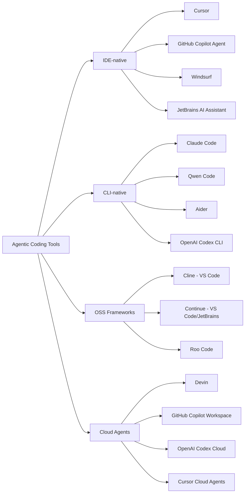
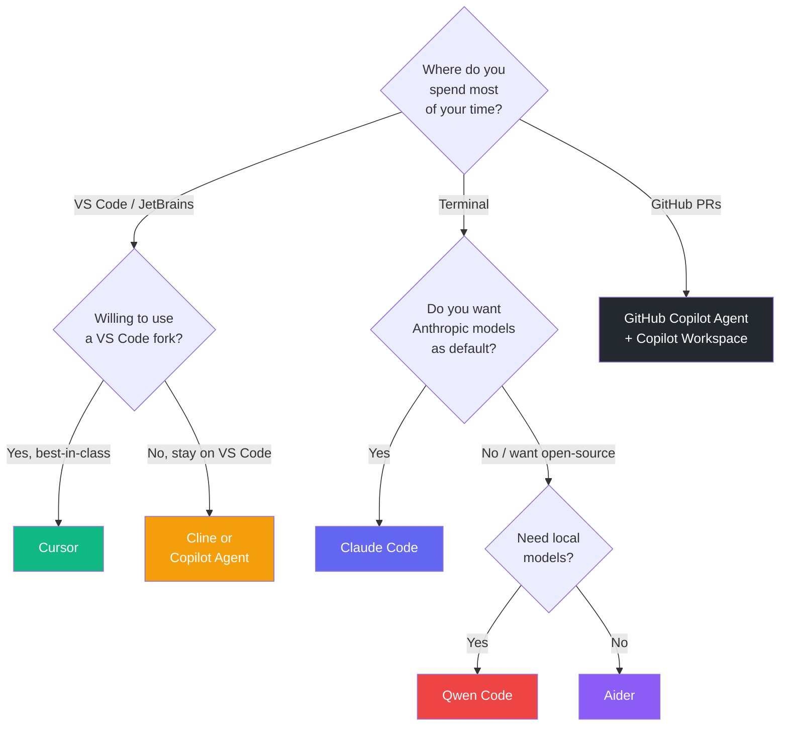

# Step 03 · The AI Coding Tool Landscape (2026)

> **⏱️ Time:** ~1 hour · **Prereq:** Step 02

You do **not** need to master every tool. You need to know the *categories*, pick 1–2 daily drivers, and be comfortable switching.

---

## 🎯 What you'll learn

- The 4 categories of agentic coding tools.
- The tradeoffs between **IDE-native** and **CLI-native**.
- Which tool fits which kind of task.
- How to make a "primary + sidekick" setup.

---

## The 4 categories

### 1. IDE-native (the "in-editor" experience)

Built into (or deeply integrated with) your code editor.

| Tool | Strength | Weakness | Pricing |
|------|----------|----------|---------|
| **Cursor** | Best-in-class agent + inline edits + rules/skills/hooks | Forks VS Code (not VS Code itself) | ~$20/mo |
| **GitHub Copilot (Agent Mode)** | Universal, works in VS Code / JetBrains / Xcode; deep GitHub integration; MCP support | Less bleeding-edge | $10–39/mo |
| **Windsurf** | Cascade "flow" feels very natural | Smaller ecosystem | ~$15/mo |
| **JetBrains AI Assistant** | Native for IntelliJ/PyCharm users | Catching up on agent features | ~$10/mo |

### 2. CLI-native (the "agent in a terminal" experience)

Run in your shell, see your files, execute commands directly.

| Tool | Strength | Weakness | Pricing |
|------|----------|----------|---------|
| **Claude Code** | Most agent-native workflow; Skills, hooks, subagents, plugins | Tied to Anthropic | Usage-based |
| **OpenAI Codex CLI** | Great GPT integration | Newer ecosystem | Usage-based |
| **Qwen Code** | Fully open; can run local (480B params!); fully self-hostable | Infra required for best perf | Free (model costs) |
| **Aider** | Token-efficient repo-map; git-native auto-commits | Terminal-only UX | Free (model costs) |

### 3. OSS extensions for VS Code / JetBrains

| Tool | Strength | Weakness |
|------|----------|----------|
| **Cline** | Autonomous with step approval; 75+ providers | UI still evolving |
| **Continue** | Most flexible config; VS Code + JetBrains | Less "agentic" by default |
| **Roo Code** | Cline fork with deep role-based modes | Smaller community |

### 4. Cloud agents (work happens on a remote sandbox)

You assign a task, they return a PR.

| Tool | Strength | Weakness |
|------|----------|----------|
| **Devin** | Full autonomous "employee" UX | Expensive; mixed reviews |
| **GitHub Copilot Workspace / Copilot coding agent** | Tight GitHub issue → PR loop | GitHub-only |
| **Cursor Cloud Agents** | Spawn agents from your phone/web | Still maturing |
| **OpenAI Codex (Cloud)** | Parallel multi-task execution | Newer |

---

## How to choose: decision tree

---

## My recommended "primary + sidekick" setups

Pick a **primary** (your daily driver) and a **sidekick** (for when the primary is stuck or the task is specialized).

| Primary | Sidekick | Best for |
|---------|----------|----------|
| **Cursor** | **Claude Code** | Full-time engineers who want the best GUI + a CLI fallback for multi-step refactors |
| **Claude Code** | **Cursor** | Power users who live in the terminal but want an IDE for browsing |
| **GitHub Copilot** | **Aider** | GitHub-heavy teams wanting governance + a free terminal fallback |
| **Cline** | **Qwen Code** | Privacy-focused / self-hosted / no-cloud environments |

> Going through this roadmap, **we'll use both Cursor (Step 04) and Claude Code (Step 05)**. If you can, install both. They're complementary.

---

## 🎥 Watch

- **[Every AI Coding Tool Compared (2026) — Matt Pocock](https://www.youtube.com/results?search_query=ai+coding+tools+comparison+2026+matt+pocock)** (search — this genre updates fast)
- **[Fireship — AI coding tool showdown](https://www.youtube.com/@Fireship)** (search his channel; short, funny, current)
- **[Cline vs Cursor vs Claude Code — honest comparison](https://www.youtube.com/results?search_query=cline+cursor+claude+code+comparison+2026)**

## 📚 Read

- 📘 [**caramaschiHG/awesome-ai-agents-2026**](https://github.com/caramaschiHG/awesome-ai-agents-2026) — 340+ tools across 20+ categories; bookmark it.
- 📄 [**Ry Walker — AI Coding Assistants Compared**](https://rywalker.com/research/ai-coding-assistants) — honest research.
- 📄 [**State of AI Report 2025/26**](https://www.stateof.ai/) — yearly industry pulse.

---

## ✍️ Exercise (30 min)

1. Install **two** tools from different categories — e.g., Cursor (IDE) + Claude Code (CLI), *or* VS Code + Cline (OSS) + Aider (CLI).
2. Give them **the same small task** (e.g., "add input validation to the /login endpoint of my demo repo").
3. Fill in this table in your learning log:

| Tool | How many turns? | Quality 1–5 | What I liked | What frustrated me |
|------|-----------------|-------------|--------------|---------------------|
| (Tool 1) | | | | |
| (Tool 2) | | | | |

This 20-minute exercise will teach you more about tool differences than any blog post.

---

## ✅ Self-check

1. Name one tool from each of the 4 categories.
2. When would you pick a **cloud agent** over an IDE agent?
3. What's the benefit of having a CLI sidekick to an IDE primary?

---

## 🧭 Next

→ [Step 04 · Cursor Mastery](./04-cursor-mastery.md)
