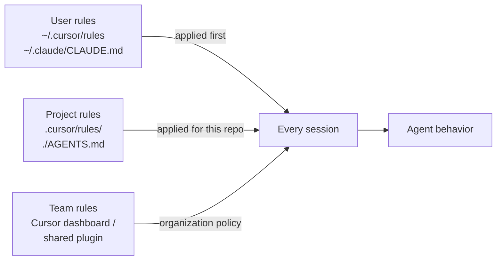

# Step 07 · Rules & Memory

> **⏱️ Time:** ~2 hours · **Prereq:** Step 06

Rules and memory turn a generic agent into *your team's* agent. Skipping this step is why people complain "AI doesn't understand our codebase."

---

## 🎯 What you'll learn

- The three scopes: **user**, **project**, **team**.
- The 2026 cross-tool standard: **AGENTS.md**.
- When to use *rules* vs. *skills* vs. *commands* vs. *memory*.
- How to write rules that *don't* get ignored.

---

## 1. Why rules exist

Every chat starts with the LLM knowing only:
- Its training data (everything up to some cutoff)
- The system prompt the tool added
- Whatever you type right now

It does **not** know:
- Your stack
- Your coding conventions
- Your team's "don'ts"
- Which files are load-bearing vs. scratch

Rules are how you teach it — once — so you never have to repeat yourself.

---

## 2. The three scopes



| Scope | Best for | Example |
|-------|----------|---------|
| **User** | Personal preferences that follow *you* across projects | "I hate emojis in code. Prefer tabs. Commit messages in imperative mood." |
| **Project** | Stack, conventions, don'ts for this repo | "We use Fastify 5 + Prisma + Vitest. Don't touch prisma/migrations/." |
| **Team** | Organization-wide policy | "All new endpoints must use our internal `AuthedHandler` wrapper." |

---

## 3. The `AGENTS.md` standard

**The single best 2026 convention:** put a file named `AGENTS.md` at your repo root.

- Claude Code reads it automatically.
- Cursor reads it (and `.cursor/rules/` also).
- OpenAI Codex reads it.
- Aider and Cline respect it.
- Any future tool *should* read it too.

This means your rules travel with the repo across tools. **Write once, use everywhere.**

### Starter template

```markdown
# AGENTS.md

## Project overview
One-paragraph: what this is, who uses it, what it talks to.

## Tech stack
- Language: TypeScript 5.4, strict mode
- Runtime: Node 20
- Framework: Fastify 5
- DB: Postgres 16 via Prisma 5
- Tests: Vitest
- Lint: Biome

## Project structure
- `src/routes/` — HTTP routes, one file per resource
- `src/services/` — business logic, pure functions when possible
- `src/db/` — Prisma client + queries
- `scripts/` — one-off ops scripts
- `docs/` — architecture and runbooks

## Conventions
- Errors: always `throw new AppError(code, status, message)` from `src/errors.ts`.
- Logging: always `logger.info({ ctx }, "message")` — structured, no `console.log`.
- Tests: colocated as `foo.test.ts`. One `describe` per exported function.
- Names: `camelCase` for funcs/vars, `PascalCase` for types, `SCREAMING` for env vars.

## Commands you can run
- `pnpm dev` — hot-reload local dev
- `pnpm test` — Vitest, one-shot
- `pnpm typecheck` — tsc --noEmit
- `pnpm lint` — Biome + fix

## Before claiming "done"
Always run: `pnpm typecheck && pnpm test && pnpm lint`.

## Hard "don'ts"
- Do NOT add new dependencies without asking.
- Do NOT edit `prisma/migrations/*`.
- Do NOT push to `main` directly — always open a PR.
- Do NOT use `any` unless you add a comment explaining why.

## Preferred workflow
1. Restate the goal in your own words.
2. Propose a numbered plan.
3. Wait for my "go".
4. Edit in small commits.
5. Run the full check command. Report results.
```

> 🎯 **The magic:** 5 minutes writing this saves you dozens of re-prompts forever.

---

## 4. How to write rules that *don't* get ignored

Anthropic and Cursor have both published research on this. Consistent findings:

1. **Keep under ~500 lines total** across all rule files. More and the model downweights them.
2. **Use concrete examples, not abstract principles.** "Follow our error style — see `src/errors.ts:12`" beats "follow best practices."
3. **Group by file pattern** when possible. A rule that only loads for `*.tsx` is more effective than one loaded everywhere.
4. **State it as an imperative.** "Do X" > "You should consider doing X."
5. **List explicit don'ts.** Models pattern-match to the most recent training data; your don'ts counteract that.
6. **Point to files, don't paste them.** "See `src/db/queries.ts` for the query pattern we use" is better than pasting 200 lines.
7. **Review your rules quarterly.** When you catch the agent doing something wrong 3 times, add a rule.

### Bad rule
> "Write clean, maintainable, high-quality TypeScript."

### Good rule
> "TypeScript: use `type` aliases, not `interface`. No `any` without a `// @rationale: …` comment above. Export named, not default. See `src/services/user.ts` for the canonical style."

---

## 5. Memory vs. Rules vs. Skills vs. Commands

People conflate these. Here's the crisp difference:

| Thing | When it loads | Contains | Example |
|-------|---------------|----------|---------|
| **Rule** | Automatically, based on scope/globs | Instructions the agent should always follow | "Use Biome not ESLint" |
| **Memory** (where supported) | Automatically, cross-session | Facts the agent has *learned* about you | "User prefers `fn` over `function`" |
| **Skill** | Loaded on demand when task matches | Step-by-step how-to + optional scripts | How to publish a release |
| **Command** (slash-command) | Explicitly invoked (`/foo`) | A saved prompt you run often | `/review` = "review the last commit" |

**Rule of thumb:**
- *"The agent should always do X"* → rule
- *"When I ask, do X this exact way"* → skill
- *"Let me trigger X in one keystroke"* → command
- *"Remember what I told you"* → memory

---

## 🎥 Watch

- **[Cursor docs: Rules](https://cursor.com/docs/context/rules-for-ai)** — official video + text.
- **["The AGENTS.md convention explained"](https://www.youtube.com/results?search_query=AGENTS.md+convention+tutorial)** — search recent videos.
- **[Theodoros Kokosioulis — Cursor rules complete guide](https://theodoroskokosioulis.com/blog/cursor-rules-commands-skills-hooks-guide/)** — clearest written deep dive.

## 📚 Read

- 📘 [**PatrickJS/awesome-cursorrules**](https://github.com/PatrickJS/awesome-cursorrules) — 1000s of community rule files. Steal.
- 📘 [**openai/agents.md spec**](https://github.com/openai/agents.md) — the emerging AGENTS.md spec.
- 📘 [**Anthropic: Writing effective tools for agents**](https://www.anthropic.com/engineering/writing-tools-for-agents) — applies to rules too.

---

## ✍️ Exercise (45 min)

In a real project:

1. Write an `AGENTS.md` using the template above. Adapt every section to *your* project.
2. Copy the same content to `.cursor/rules/project.mdc` with `alwaysApply: true`, for Cursor compatibility. (Yes, duplication for now — the tools will converge.)
3. Open a fresh agent session and ask: *"What is this project?"* — verify the agent's summary matches reality.
4. Ask it to add a trivial new feature (a new `/health` endpoint). Did it follow all your conventions without being told?
5. Commit to git. Your future self (and teammates) will thank you.

---

## ✅ Self-check

1. What goes in an `AGENTS.md`?
2. Why point to files instead of pasting code in rules?
3. When is a **skill** better than a **rule**?

---

## 🧭 Next

→ [Step 08 · Skills](./08-skills.md)
