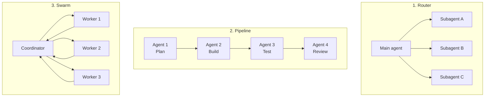

# Step 12 · Subagents & Orchestration

> **⏱️ Time:** ~3 hours · **Prereq:** Step 11

Single-agent mode tops out somewhere around "refactor one module." Real projects need **teams of agents**. This step is how you get there.

---

## 🎯 What you'll learn

- What a subagent is, and what it costs.
- Three orchestration patterns: **Router**, **Pipeline**, **Swarm**.
- Built-in subagents in Cursor and Claude Code.
- When (and when *not*) to delegate.

---

## 1. Why subagents exist

Context pollution is the silent killer of long agent sessions:

- You ask: *"Refactor auth."*
- Agent reads 20 files.
- All 20 files are now in the main context window.
- Your next question: *"Now do the same to billing."*
- The auth noise is still in there, eating tokens, confusing the model.

A **subagent** is a *child* agent spun up with:
- Its own fresh context window.
- A scoped task.
- Only the summary comes back to the parent.

Result: the parent stays focused, and the child can dive deep without polluting.

```
  PARENT AGENT            SUBAGENT
  ┌────────────┐          ┌────────────┐
  │ task: big  │          │ task: tiny │
  │ context:   │          │ context:   │
  │  clean     │────────► │  filled    │
  │            │ ◄────────│  with noisy│
  │  summary   │  summary │  exploration
  └────────────┘          └────────────┘
```

---

## 2. Built-in subagents (2026)

Both Cursor and Claude Code ship these:

| Subagent | What it's for | Mode |
|----------|---------------|------|
| **explore** | Find files, read code, summarize architecture | read-only |
| **shell** / **bash** | Execute a shell command series | write-capable |
| **generalPurpose** | Full-power sub-agent for multi-step tasks | write-capable |
| **browser-use** | Navigate web pages, fill forms, test UIs | via MCP |

### How to invoke

In Cursor or Claude Code, just *ask*:

> "Use the **explore** subagent to find every place we call our deprecated `oldApi` helper. Summarize the patterns and suggest a migration order."

The agent spawns the subagent, waits for its summary, and continues.

### Foreground vs. background

- **Foreground** — blocks until the subagent finishes. Use for sequential tasks.
- **Background** — returns immediately; the subagent runs in parallel. Use for long/parallel tasks.

You can launch 5 subagents in parallel if the work is independent. Massive speedup.

---

## 3. The three orchestration patterns



### Pattern 1: Router (classify, then delegate)

The main agent decides *which* specialist handles the task.

> **User:** "I need to upgrade TypeScript to v5.5 everywhere."
>
> **Main agent (internal):** This is a multi-file codemod. Delegate to `generalPurpose` subagent. It delegates the DB-specific migration piece to a separate `postgres-migrator` subagent.

**When to use:** when tasks fall into clear categories (UI vs. infra vs. docs).

### Pattern 2: Pipeline (staged workflow)

Each stage is a separate agent with a single job. Output of stage N is input to stage N+1.

> Plan → Build → Test → Review → Write PR

Each has a narrow prompt + narrow context. The main agent is just the conductor.

**When to use:** for repetitive workflows you do often.

### Pattern 3: Swarm (parallel + aggregate)

Fan out N subagents in parallel, each on an independent piece. Aggregate results.

> **User:** "Find every place in our monorepo that uses the old Axios interceptor."
>
> **Coordinator:** spawns 5 `explore` subagents, one per package, in parallel. Merges summaries.

**When to use:** embarrassingly parallel tasks (search, scan, per-file transforms).

---

## 4. Five real-world orchestration recipes

### 🧭 Recipe 1: Plan-Code-Review
```
main agent
  └─ explore subagent: build architecture map
  └─ generalPurpose subagent: implement feature, write tests
  └─ reviewer subagent (with review-pr skill): review + produce PR description
```

### 🧪 Recipe 2: Test-first migration
```
main agent
  └─ For each of 20 files: spawn generalPurpose subagent in parallel
      task: "Add a Jest→Vitest migration. Keep green."
  └─ Aggregator: produces a summary diff.
```

### 🔎 Recipe 3: Multi-repo triage
```
main agent (parent dir containing 8 git repos)
  └─ For each repo: spawn an explore subagent to inventory uses of old API.
  └─ Aggregator: produces a cross-repo migration doc.
```

### 🖥 Recipe 4: UI regression sweep
```
main agent
  └─ browser-use subagent: visit every page from sitemap.xml, screenshot, report visual diffs
```

### 🧹 Recipe 5: Dead-code hunter
```
main agent
  └─ explore subagent 1: list all exports
  └─ explore subagent 2: list all imports
  └─ aggregator: diff to find exports never imported (dead code candidates)
```

---

## 5. When **not** to use subagents

🚫 Simple 1-file tasks — overhead isn't worth it.
🚫 Tasks where the result needs to build on a LOT of context — summaries lose info.
🚫 Tasks that require the parent's ongoing conversation — subagent can't see it.

> **Rule of thumb:** if the task is >10 minutes of work OR touches >10 files OR can be parallelized → subagent. Otherwise, just do it in the parent.

---

## 6. Cost caution ⚠️

Each subagent is a **new LLM conversation** with its own system prompt, rules, and context startup. That's tokens.

10 parallel subagents = 10x base context cost. Know what you're doing before firing a swarm at a cheap model.

---

## 🎥 Watch

- **[Anthropic — Multi-agent systems talk](https://www.youtube.com/results?search_query=anthropic+multi+agent+systems)**
- **[Cursor subagents walkthrough](https://www.youtube.com/results?search_query=cursor+subagents+tutorial)**
- **[Claude Code subagents deep dive](https://www.youtube.com/results?search_query=claude+code+subagents)**

## 📚 Read

- 📘 [**Cursor docs — Subagents**](https://cursor.com/docs/subagents)
- 📘 [**Anthropic — Multi-agent research**](https://www.anthropic.com/research/multi-agent-research-system) — legendary read.
- 📘 [**LangGraph — multi-agent patterns**](https://langchain-ai.github.io/langgraph/concepts/multi_agent/) — cross-framework patterns, applicable beyond LangGraph.

---

## ✍️ Exercise (1 hour)

Pick a real project. Run these three experiments:

1. **Router:** Ask your main agent to use the `explore` subagent to map the codebase, then the `generalPurpose` subagent to add a new feature based on the map. Observe which context the *main* agent ends up carrying.
2. **Swarm:** In a multi-package monorepo (or just a repo with multiple subfolders), ask: *"For each top-level folder in `packages/`, spawn an explore subagent in parallel to list its exports. Then aggregate into one table."*
3. **Pipeline:** Build a custom pipeline: *"Use explore to survey → generalPurpose to code → browser-use to test → skills-based reviewer for the PR body."*

Log the token cost (if visible) and how long each approach took vs. doing it single-agent.

---

## ✅ Self-check

1. What's the main reason to delegate to a subagent instead of just working in the parent?
2. When is a Pipeline pattern better than a Router?
3. What's one situation where subagents are overkill?

---

## 🧭 Next

→ [Step 13 · Context Engineering](./13-context-engineering.md) — *the 2026 breakout skill.*
