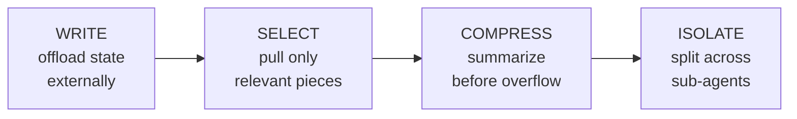

# Step 13 · Context Engineering

> **⏱️ Time:** ~3 hours · **Prereq:** Step 12

> *"Context engineering: the delicate art and science of filling the context window with just the right information for the next step."* — Andrej Karpathy

Gartner named context engineering the **breakout AI skill of 2026**. If you master one thing in this roadmap beyond "using the tool," make it this.

---

## 🎯 What you'll learn

- Why bigger context windows did **not** solve the context problem.
- The **4 failure modes** that break agents.
- The **Write / Select / Compress / Isolate** pattern.
- 8 concrete context-engineering moves you can apply today.

---

## 1. Prompt engineering vs. context engineering

| | Prompt engineering | Context engineering |
|--|---|---|
| **Object of focus** | The *question* you ask | *Everything the model sees* |
| **Time horizon** | Per turn | Per session + cross-session |
| **Inputs** | Your instructions | Instructions + tool defs + history + retrieved docs + agent state |
| **Outcome** | Better single answer | Reliable long-running agent |

They're complementary. **Prompt engineering is a subset of context engineering.**

---

## 2. The "bigger window" fallacy

Models in 2026 support 1M+ tokens. Problem solved, right?

No. Quality measurably degrades past ~32–64K tokens. This is documented across vendors and is called the **"lost in the middle"** problem. A focused 20K-token context **outperforms** a bloated 200K-token context on almost every task.

> **Karpathy law of context:** *The best context is the smallest context that still contains everything the model needs.*

---

## 3. The 4 failure modes

Every weird agent moment is one of these:

### 1. Context Poisoning
Hallucinations enter context → get treated as truth forever after.
> *Fix:* Force tool-based verification of facts; clear context when it's compromised.

### 2. Context Distraction
Too much accumulated info → the model forgets its basics.
> *Fix:* Trim aggressively. Start new sessions often.

### 3. Context Confusion
Irrelevant info influences decisions.
> *Fix:* Scope context. Don't dump the whole repo.

### 4. Context Clash
Conflicting statements in different parts of context.
> *Fix:* Summarize + single source of truth. Prefer recent info.

---

## 4. The 4 core patterns

### 1. Write — externalize state
Don't try to "remember" everything in context. Push it out to:
- A scratchpad file (`./agent-notes.md`).
- A memory MCP server.
- An external DB / vector store.

Pull it back in only when needed.

### 2. Select — retrieve only what's relevant
Before every step, ask: *"What does the model actually need right now?"* Pull that. Leave the rest.

This is what tools like Aider's "repo map," RAG, and `@file` references in Cursor do.

### 3. Compress — summarize before context overflows
At a checkpoint (e.g., after finishing a phase), compact the history:
- Claude Code has `/compact`.
- Cursor automatically summarizes old turns (you can trigger too).
- Or do it manually: *"Summarize everything we've done so far into 10 bullet points. I'll start a fresh chat from that."*

### 4. Isolate — scope into sub-agents
Move noisy exploration into a subagent (Step 12). Only its summary returns.

---

## 5. 8 concrete moves (copy-paste into your habits)

### Move 1 — Start fresh sessions often
A new chat is *free cleanup*. Multi-hour sessions are a smell.

### Move 2 — Pin the goal at the top
Re-state the goal every few turns. It pushes to the bottom otherwise and gets forgotten.

### Move 3 — Use `@file` instead of pasting files
Tools load files on demand; pasting bloats permanently.

### Move 4 — Prefer summaries over raw outputs
After a tool run produces 500 lines of logs: *"Summarize the key signals and drop the rest."* Then keep the summary, not the logs.

### Move 5 — Progressive disclosure in rules
Short `description`, long body loads only when relevant. (This is why skills work so well.)

### Move 6 — Named scratchpads
Let the agent write conclusions to `./agent-notes/task-X.md`. It can re-read later — without carrying history.

### Move 7 — Limit tool schemas
Exposing 40 MCP tools = 40 tool descriptions in every turn's context. Only enable what you need.

### Move 8 — Measure & iterate
Log turn-by-turn token counts. When quality drops, usually the cause is a context spike in the last 3 turns.

---

## 6. The "system prompt cooking" technique

Great agent operators treat their `AGENTS.md` / `CLAUDE.md` / rules like a *chef refining a recipe*.

1. Start with a rough version.
2. Use the agent for a week.
3. When it does something wrong, add a one-line rule.
4. When it gets confused, shorten or re-order the rules.
5. After a month you'll have a ~300-line, battle-tested file that makes *your* agent much better than a generic one.

Every time you think "ugh, I explained that three times" — that's a missing rule.

---

## 7. Anti-patterns checklist

❌ Dumping entire directories into the first prompt.
❌ Using one 3-hour chat for everything.
❌ Never clearing / compacting.
❌ Enabling 30 MCP servers "just in case."
❌ Rules longer than 500 lines.
❌ Pasting stack traces and not summarizing.
❌ Running 10 subagents with 10x redundant system prompts.
❌ Skipping `AGENTS.md` and then reprompting the same conventions 50 times.

---

## 🎥 Watch

- **[Andrej Karpathy tweets on context engineering](https://twitter.com/karpathy)** — follow him. Seriously.
- **[Lance Martin (LangChain) — Context engineering talk](https://www.youtube.com/results?search_query=context+engineering+lance+martin)**
- **[AI Engineer conference — context engineering sessions](https://www.youtube.com/@aiengineerfoundation)**

## 📚 Read

- 📄 [**ToolHalla — Context Engineering for AI Agents, Complete Guide 2026**](https://toolhalla.ai/blog/context-engineering-ai-agents-2026) — comprehensive.
- 📄 [**Lance Martin — "Context engineering"**](https://rlancemartin.github.io/2025/06/23/context_engineering/) — foundational essay.
- 📄 [**Claude Lab — Complete Guide to Context Engineering**](https://claudelab.net/en/articles/api-sdk/context-engineering-ai-agents-guide)
- 📄 [**Design.dev — Context Engineering Guide**](https://design.dev/guides/context-engineering/)
- 📄 [**"Lost in the middle" paper (Liu et al.)**](https://arxiv.org/abs/2307.03172) — the research underpinning all this.

---

## ✍️ Exercise (1 hour)

**Part A — Observe bad context (20 min):** Take a messy 3+ hour agent chat you've had. Count:
- Rough tokens of dead weight (tool outputs you no longer need).
- How many topics got mixed.
- How many times the agent *re-asked* something it should have remembered.

**Part B — Apply the 4 patterns (40 min):** Re-do that same task applying:
1. **Write** — scratchpad file the agent writes to.
2. **Select** — use `@file` references instead of pasting.
3. **Compress** — `/compact` halfway, or start a fresh chat with a handoff summary.
4. **Isolate** — exploration in a subagent.

Compare time, quality, token cost. Log the delta.

---

## ✅ Self-check

1. Name the 4 context-failure modes.
2. Why does a 200K-token context often perform *worse* than a 20K-token one?
3. When would you use `/compact` vs. start a fresh session?

---

## 🧭 Next

→ [Step 14 · Evals & Testing](./14-evals-testing.md)
