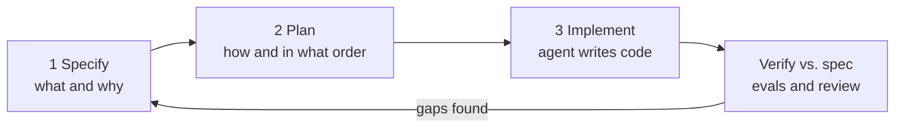
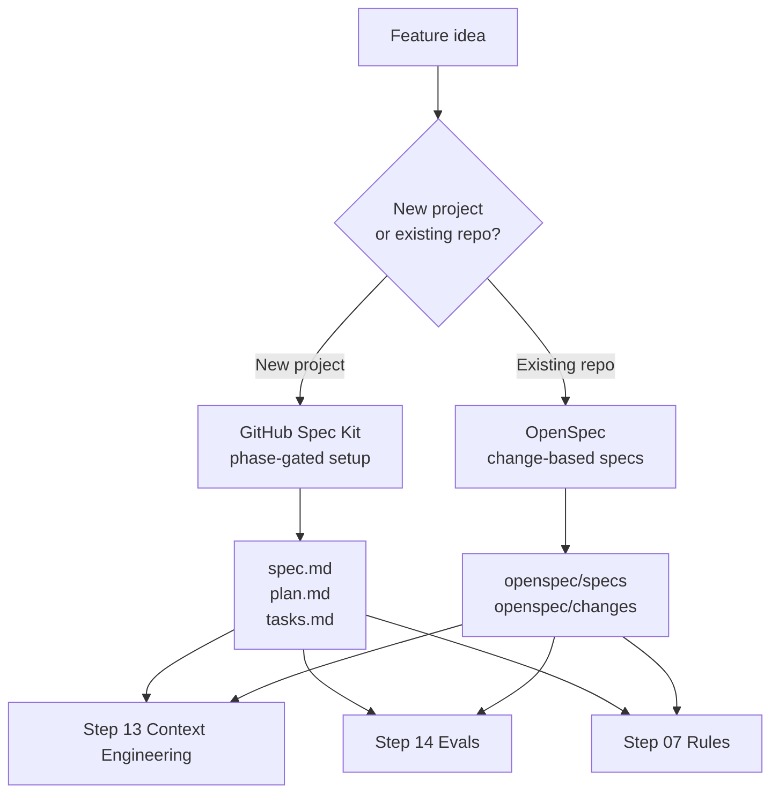

# Step 13.5 · Spec-Driven Development (SDD)

> **⏱️ Time:** ~2 hours · **Prereq:** Step 13 · **Next:** Step 14

> *"The spec is the new source of truth. Code is the build artifact."* — 2026 industry consensus

This is the discipline that turns "vibe coding" (vague prompts → hoping the agent guesses right) into **precise, traceable, agentic engineering** (written spec → AI implements → you verify against the spec).

---

## 🎯 What you'll learn

- What **Spec-Driven Development (SDD)** is and why it exploded in 2026.
- The 3-phase workflow everyone agrees on: **Specify → Plan → Implement**.
- **GitHub Spec Kit** — the most popular, easy-to-start open-source SDD toolkit.
- How specs become high-quality *context* (Step 13) and executable *evals* (Step 14).

---

## 1. What is Spec-Driven Development?

> **Spec-Driven Development (SDD)** is the practice of writing a precise specification *before* any code — and letting the AI agent generate, refactor, or regenerate the code from that spec. The spec is reviewed like code, versioned like code, and treated as the **source of truth**.

Plain words: instead of typing "add photo sharing to my app" and hoping, you write a short document that says *what* the feature is, *who* uses it, *how* it must behave at the edges, and *how you'll know it works*. Then the agent builds to that document.

### Old loop (vibe coding)
`prompt → code → tests → docs (maybe)`

### New loop (SDD)
`spec → plan → AI code → verify vs. spec`

Code becomes a **build artifact**. The spec is what you maintain.

---

## 2. Why it matters now

| Problem with raw prompting | How SDD fixes it |
|---|---|
| Agent guesses missing requirements | Requirements are **explicit and testable** |
| Context pollution over long sessions | Spec is a **compact, canonical context** to re-load |
| Hard to onboard teammates | Spec *is* the onboarding doc |
| No way to verify "done" | Acceptance criteria = **evals input** |
| Rewrites lose intent | Rewrites regenerate from the **same spec** |

Anthropic's 2026 Agentic Coding Trends Report, GitHub's Spec Kit launch, AWS Kiro, and Martin Fowler's writeups all converge on the same insight: **the bottleneck is no longer writing code — it's knowing what to build.**

---

## 3. The 3-phase workflow (easy to memorize)



### Phase 1 — Specify (the *what* and *why*)
Write a short `spec.md` (or `requirements.md`) with:
- **Problem** — one sentence.
- **Users** — who benefits.
- **Scope** — what's in / what's out.
- **Acceptance criteria** — bullet list of "system does X when Y."
- **Edge cases** — empty inputs, errors, limits.

Optional but powerful: **EARS notation** (Easy Approach to Requirements Syntax):
> *"When `<trigger>`, the `<system>` shall `<response>`."*

### Phase 2 — Plan (the *how*)
Have the agent turn the spec into:
- `plan.md` — technical approach, chosen libraries, tradeoffs.
- `tasks.md` — ordered, small, independently-verifiable tasks.

Review and edit before any code is written. **This is where most of the value is created.**

### Phase 3 — Implement & verify
- Agent executes `tasks.md` one task at a time.
- After each task, run tests / evals that map 1:1 to the **acceptance criteria** from Phase 1.
- Spec drifts? Update the spec first, then regenerate.

---

## 4. Two top tools: GitHub Spec Kit and OpenSpec

Both are open source, tool-agnostic, and production-ready in 2026. Pick whichever fits your situation (table at the end of this section).

### 4A. GitHub Spec Kit (greenfield-friendly, phase-gated)

**Why Spec Kit:** open-source, free, works with Cursor, Claude Code, GitHub Copilot, Gemini CLI, Codex, and ~20+ other agents. It's the closest thing to a canonical, process-heavy SDD toolkit.

Repo: `https://github.com/github/spec-kit` · License: MIT · Install: Python / `uvx`

**Install (one command)**
```bash
uvx --from git+https://github.com/github/spec-kit.git specify init <project-name>
```

**The slash commands you'll use 90% of the time**
| Command | What it does |
|---------|--------------|
| `/speckit.constitution` | Define project-wide principles (stack, style, non-negotiables). |
| `/speckit.specify` | Generate the feature spec from a high-level description. |
| `/speckit.clarify` | Agent asks you questions to remove ambiguity. |
| `/speckit.plan` | Turn spec into a technical plan + task list. |
| `/speckit.tasks` | Break the plan into small, ordered coding tasks. |
| `/speckit.implement` | Agent executes tasks one by one. |

**A 10-minute feel for it**
1. `specify init weekly-report-cli`
2. In Cursor/Claude Code, run `/speckit.constitution` → set: "TypeScript, pnpm, Vitest, no external services."
3. Run `/speckit.specify "Build a CLI that summarizes my git commits from the last 7 days."`
4. Run `/speckit.clarify` → answer 3–5 questions.
5. Run `/speckit.plan`, review `plan.md`, tweak.
6. Run `/speckit.implement` → watch the agent build it task-by-task.
7. Open a PR; the spec is reviewed **alongside** the code.

---

### 4B. OpenSpec (brownfield-first, lightweight)

**Why OpenSpec:** "the most loved spec framework" on GitHub (~40K stars). Designed to be **fluid, iterative, and brownfield-first** — perfect for adding SDD to an existing repo without rewriting anything. Works with 30+ agents via slash commands.

Repo: `https://github.com/Fission-AI/OpenSpec` · License: MIT · Install: Node.js / `npm`

**Install (one command)**
```bash
npm install -g @fission-ai/openspec@latest
cd your-project
openspec init
```

**Core concept: `specs/` vs `changes/`**
```
openspec/
  specs/              ← source of truth (current system behavior)
    auth/spec.md
    billing/spec.md
  changes/            ← proposed deltas (one folder per change)
    add-dark-mode/
      proposal.md
      specs/          ← spec delta (only what changes)
      design.md
      tasks.md
```
When a change is merged, OpenSpec archives it into `specs/`. Your **living spec** evolves alongside your code.

**The slash commands you'll use 90% of the time** (Claude Code uses `/opsx:<cmd>`; Cursor/Windsurf/Copilot use `/opsx-<cmd>`)
| Command | What it does |
|---------|--------------|
| `/opsx:propose <name>` | Create a change and generate planning artifacts in one step. |
| `/opsx:explore` | Think through ideas before committing to a change. |
| `/opsx:apply` | Implement the change against the approved spec. |
| `/opsx:verify` | Check implementation against the spec (three-dimensional validation). |
| `/opsx:archive` | Merge the change's spec delta into the main `specs/`. |
| `/opsx:onboard` | 15–30 min guided tour using your own codebase. |

**A 10-minute feel for it (brownfield)**
1. In any existing repo: `openspec init` — picks up Claude Code, Cursor, Copilot, Windsurf, Codex, etc.
2. In your agent, run `/opsx:propose add-dark-mode`.
3. Review the generated `openspec/changes/add-dark-mode/` folder (proposal, spec delta, design, tasks).
4. Run `/opsx:apply` — the agent implements against the approved spec.
5. Run `/opsx:verify` to check behavior matches the spec.
6. Run `/opsx:archive` to merge the delta into `specs/`.

---

### Pick one (quick decision table)

| You are… | Pick |
|---|---|
| Starting a new (greenfield) project, want phase gates and structure | **GitHub Spec Kit** |
| Adding SDD to an existing (brownfield) repo, want minimum ceremony | **OpenSpec** |
| Python shop / already using `uvx` | Spec Kit |
| Node shop / want `npm i -g` | OpenSpec |
| Need spec deltas and change-by-change history | OpenSpec |
| Want strict 6-phase pipeline (constitution → specify → clarify → plan → tasks → implement) | Spec Kit |
| Locked into one IDE and okay with that | AWS Kiro (see Section 5) |
| Want zero tooling | Plain `spec.md` per feature (see Section 5) |

Most learners will use **OpenSpec** on existing work and **Spec Kit** on new projects. You don't have to marry one.

---

## 5. Other options worth knowing (1-line each)

- **AWS Kiro** — agentic IDE that pioneered the `requirements.md` / `design.md` / `tasks.md` three-file pattern; locked to Kiro + Claude.
- **Tessl** — "package manager for agent skills and specs," enterprise focused.
- **Windsurf / Jules Plan Mode** — spec-style planning baked into the default UI.
- **BMAD** — multi-agent SDD framework; powerful but heavier setup.
- **Plain Markdown + AGENTS.md** — if you don't want a tool at all, just keep a `spec.md` per feature and point the agent at it. This is 80% of the value.

---

## 6. Three levels of commitment (Martin Fowler's framing)

| Level | Philosophy | When to use |
|-------|-----------|-------------|
| **Spec-first** | Write a spec, then code. Code stays primary. | Starter level. Safe for any team. |
| **Spec-anchored** | Spec is the governing contract; code can temporarily diverge. | Recommended default in 2026. |
| **Spec-as-source** | Spec is the source. Code is regenerated on demand. | Greenfield / fast-moving teams. |

Most teams land on **spec-anchored**. Pick your level deliberately.

---

## 7. How SDD plugs into the rest of the roadmap



- **Step 13 (Context Engineering):** a good spec is the single most valuable thing you can *select* into context.
- **Step 14 (Evals):** every acceptance criterion is a testable eval row.
- **Step 07 (Rules):** project-wide rules in the spec constitution prevent the agent from wandering.
- **Step 12 (Subagents):** each task in `tasks.md` is a perfect scope for a subagent.

---

## 8. Common pitfalls (learn these once)

- **Specification theater** — writing long specs nobody reads. Keep it **human-reviewable** (one screen is ideal).
- **Over-specifying too early** — trying to capture every pixel before building. Let specs **evolve**.
- **Spec drift** — code changes but the spec doesn't. Update the spec *first*, always.
- **Monolithic specs** — break features into INVEST-sized slices (Independent, Negotiable, Valuable, Estimable, Small, Testable).
- **No verification loop** — if you never check code against the spec, you're back to vibe coding.

---

## ✅ Hands-on exercise (60 min)

Do **one** path. Path A is greenfield; Path B is brownfield. Most learners get more value from Path B.

### Path A — Greenfield with GitHub Spec Kit

Pick the smallest feature from [projects/practice-projects.md](../projects/practice-projects.md) (e.g. B1 `/commit` slash command).

1. Install GitHub Spec Kit: `uvx --from git+https://github.com/github/spec-kit.git specify init commit-coach`.
2. Run `/speckit.constitution` with 3 rules (e.g. "conventional commits," "no network calls," "one file only").
3. Run `/speckit.specify "A /commit slash command that turns git diff --staged into a conventional-commit message."`
4. Run `/speckit.clarify`, answer the questions.
5. Run `/speckit.plan` and `/speckit.tasks`.
6. Run `/speckit.implement`.
7. Write 3 evals mapped to your acceptance criteria.
8. Commit the spec **alongside** the code.

### Path B — Brownfield with OpenSpec

Open one of your own existing repos (ideally one you know well, with room for a small improvement).

1. `npm install -g @fission-ai/openspec@latest && openspec init` in the repo root.
2. In your agent, run `/opsx:onboard` for a 15-minute guided tour (optional but recommended first time).
3. Pick a small real improvement (e.g. "add a CLI flag," "rename a config key," "add caching to X").
4. Run `/opsx:propose <change-name>`.
5. Open `openspec/changes/<change-name>/` and review `proposal.md`, the spec delta under `specs/`, `design.md`, and `tasks.md`.
6. Edit the proposal to remove anything incorrect — this is where your leverage is.
7. Run `/opsx:apply` and let the agent implement it task-by-task.
8. Run `/opsx:verify` and fix drift between spec and code.
9. Write 3 evals mapped to the acceptance criteria in the delta spec.
10. Run `/opsx:archive` to merge the delta into `openspec/specs/`.

**You'll learn:** how specs compress context, reduce hallucinations, and give you a reviewable contract with the agent. Path B also shows you how SDD fits into a real codebase instead of a toy one.

---

## 📚 Go deeper

- GitHub Spec Kit — https://github.com/github/spec-kit
- GitHub Blog, *Spec-driven development with AI* — https://github.blog/ai-and-ml/generative-ai/spec-driven-development-with-ai-get-started-with-a-new-open-source-toolkit/
- Spec Kit docs — https://github.github.io/spec-kit/
- OpenSpec — https://github.com/Fission-AI/OpenSpec
- OpenSpec docs and site — https://openspec.dev/ · https://openspec.pro/
- *OpenSpec vs Spec Kit vs Kiro* comparison — https://recca0120.github.io/en/2026/03/08/openspec-sdd/
- sdd.sh, *What Is Spec-Driven Development?* — https://sdd.sh/2026/03/what-is-spec-driven-development/
- Martin Fowler, *Understanding Spec-Driven Development: Kiro, Spec Kit, and Tessl*
- David Lapsley, *Spec-Driven LLM Development (SDLD)* — January 2026
- EARS notation — Easy Approach to Requirements Syntax
- AWS Kiro — https://kiro.dev

---

[⬅ Step 13: Context Engineering](./13-context-engineering.md) · [➡ Step 14: Evals & Testing](./14-evals-testing.md) · [🏠 README](../README.md)
