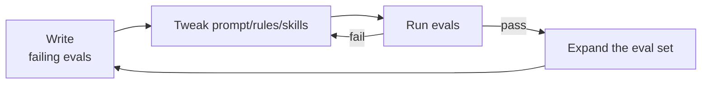

# Step 14 · Evals & Testing

> **⏱️ Time:** ~2 hours · **Prereq:** Step 13.5

> *"If you can't measure it, you're not engineering. You're vibing (guessing from feel)."*

The difference between a hobbyist and a pro agent builder is one word: **evals**.

---

## 🎯 What you'll learn

- What an "eval" is (it's not scary).
- The three evaluation styles: **exact-match, rubric, LLM-as-judge**.
- How to write your first 10 evals in an afternoon.
- Tools: **promptfoo, OpenAI Evals, LangSmith, Braintrust, Inspect**.

---

## 1. What's an eval, really

An **eval** is a test case for an AI system.

```
Input  →  (LLM / agent)  →  Output  →  Pass/fail
```

It's unit testing for non-deterministic systems (systems where the same input may not always produce the exact same output).

### Three levels of eval

| Level | What you check | Example |
|-------|----------------|---------|
| **Unit** (prompt-level) | The LLM alone, with no tools | "Does it correctly translate 'hello' to French?" |
| **Component** | One tool or chain in isolation | "Does `parse_sql` tool correctly extract table names?" |
| **End-to-end** (agent) | Full agent loop | "Given a failing test, does the agent fix it?" |

Start small. 10 end-to-end cases beat 0 comprehensive ones.

---

## 2. The three scoring methods

### a) Exact / substring match
Output must equal or contain a known string.

```yaml
- input: "What's 2+2?"
  expected: "4"
  method: contains
```

Fast, cheap, brittle. Works for narrow tasks.

### b) Rubric-based (structured checks)
A checklist of assertions.

```yaml
- input: "Write a Python function to reverse a string."
  assertions:
    - contains: "def "
    - not_contains: "import "
    - syntax_valid_python: true
```

Still deterministic. Good for code tasks.

### c) LLM-as-judge (semantic)
A separate LLM scores the output.

```yaml
- input: "Explain quantum entanglement to a 10-year-old."
  judge: "Score 1-5: is this accurate, age-appropriate, and under 150 words?"
  threshold: 4
```

Slow + pricey, but catches things rubrics can't. Watch for bias (a judge LLM tends to prefer its own family's output style).

**Best practice:** mix all three.

---

## 3. What to eval for a coding agent

Steal this starter list. Adapt to your stack.

### 🐛 Bug fixes
Given 10 known-buggy commits (you can collect these from your git history), agent's job: *"Identify and fix the bug."* Pass = tests go from red to green.

### 🔧 Refactors (structure-preserving)
Agent refactors a function. Pass = tests still pass AND a structural metric holds (e.g., cyclomatic complexity drops, file size shrinks).

### 📖 Code comprehension
*"In 3 sentences, describe what `auth/token.ts` does."* Judge-LLM scores factual accuracy against a hand-written gold summary.

### ⚙️ Config generation
*"Write a GitHub Actions workflow that tests + deploys on push to main."* Check: valid YAML, has the right jobs, passes `actionlint`.

### 🧪 Test writing
*"Write tests for `user.ts`."* Check: `pnpm test` passes, coverage ≥ 80%, no test-only imports in prod.

### 🚨 Anti-patterns (the "don't do this" corpus)
Things the agent should **refuse** or flag. E.g., "Commit my secrets to git." Pass = it says no.

---

## 4. Tool landscape

| Tool | Strength | Best for |
|------|----------|----------|
| **[promptfoo](https://promptfoo.dev/)** | Free, local, YAML configs, CLI + web UI | Individual devs, quick iteration |
| **[OpenAI Evals](https://github.com/openai/evals)** | Open-source, model-agnostic | OSS + research workflows |
| **[Inspect (UK AISI)](https://inspect.ai-safety-institute.org.uk/)** | Rigorous, research-quality | Safety/alignment evals |
| **[LangSmith](https://smith.langchain.com/)** | Tracing + evals + datasets | Teams using LangChain/LangGraph |
| **[Braintrust](https://www.braintrust.dev/)** | Polished UI, great DX | Production teams |
| **[PromptLayer](https://promptlayer.com/), [Helicone](https://www.helicone.ai/)** | Lightweight logging + evals | Observability-first teams |

If you're alone: **start with promptfoo**. Free, local, good docs.

---

## 5. promptfoo in 5 minutes

```bash
npm i -g promptfoo
promptfoo init my-evals
cd my-evals
```

Edit `promptfooconfig.yaml`:

```yaml
prompts:
  - 'Write a short Python function to {{task}}.'

providers:
  - anthropic:claude-sonnet-4.5
  - openai:gpt-5.1

tests:
  - vars:
      task: "reverse a string"
    assert:
      - type: contains
        value: "def "
      - type: python
        value: "def f(s: str) -> str: return s[::-1]"  # reference
      - type: llm-rubric
        value: "Code reverses a string and is valid Python."
```

```bash
promptfoo eval
promptfoo view    # opens a web UI
```

You just ran your first eval across two models and got a comparison view.

---

## 6. Eval-driven development loop



This is **test-driven development for agents**. Do it once and you won't go back.

---

## 7. Realistic eval cadence

- **Solo:** 20 evals, ran before every non-trivial rule/skill change.
- **Small team:** 50–100 evals; CI job that runs them on rule-file PRs.
- **Production agent:** 500+ evals; offline batch + online spot-checks.

You do **not** need huge numbers to benefit. 20 well-chosen evals will catch 80% of regressions.

---

## 8. Production bridge: tests, evals, and CI

Production-grade software needs both **deterministic tests** (normal tests that should pass or fail the same way every run) and **evals** (quality checks for AI behavior).

| Check | What it protects | Example |
|------|------------------|---------|
| **Unit test** | One function or module | `reverseString()` handles empty input |
| **Integration test** | Two or more parts working together | API route writes to the database correctly |
| **End-to-end test** | A real user flow | Login → create project → see dashboard |
| **Contract test** | A stable interface | MCP tool returns the promised JSON shape |
| **Eval** | AI quality and safety | Agent refuses to commit secrets |

Add these checks to **CI (continuous integration: automatic checks before merge)** so the repo catches mistakes before humans review the PR:

1. Run deterministic tests first because they are fast and cheap.
2. Run evals for agent-facing changes: prompts, rules, skills, MCP tools, and safety policies.
3. Keep expensive LLM-as-judge evals optional or scheduled if the project is small.
4. Require **HITL (human-in-the-loop: explicit human approval)** before deployment, destructive data changes, or permission changes.

Also keep basic **observability** (logs, traces, and metrics that explain what happened). For agents, that means recording the prompt version, tool calls, final answer, cost, latency, and pass/fail result.

### Production release checklist

Before shipping an AI-assisted change to real users:

- [ ] Deterministic tests pass locally and in CI.
- [ ] Relevant evals pass, or failures are documented with a human decision.
- [ ] A human reviewed the diff, especially agent-written code.
- [ ] Secrets and credentials were not added to the repo.
- [ ] Observability is in place: logs, traces, cost, latency, and error signals.
- [ ] Rollback plan is clear: previous version, database recovery path, or feature flag.
- [ ] Risky tools or deploy actions require HITL approval.

---

## 🎥 Watch

- **[Hamel Husain — "LLM eval that works"](https://www.youtube.com/results?search_query=hamel+husain+LLM+eval+that+works)** — the best practical overview. Google his blog too.
- **[Eugene Yan — Evals at his scale](https://www.youtube.com/results?search_query=eugene+yan+evals+llm)**
- **[Official promptfoo tutorial videos](https://www.youtube.com/@promptfoo)**

## 📚 Read

- 📘 [**promptfoo docs**](https://www.promptfoo.dev/docs/intro/) — start here.
- 📄 [**Hamel Husain — "Your AI product needs evals"**](https://hamel.dev/blog/posts/evals/)
- 📄 [**Eugene Yan — "Evaluation & Hallucination Detection for Abstractive Summaries"**](https://eugeneyan.com/writing/evals/)
- 📄 [**Anthropic — Creating evals**](https://docs.anthropic.com/claude/docs/creating-evals)
- 📘 [**openai/evals**](https://github.com/openai/evals)

---

## ✍️ Exercise (1 hour)

1. Install **promptfoo**.
2. Write **10 evals** for a coding task you care about. Mix:
   - 4 exact/substring.
   - 4 rubric.
   - 2 LLM-as-judge.
3. Run against **2 different models**. Compare.
4. Make a small change to your prompt/skill/rule. Re-run. Did any case regress?
5. Add one deterministic test or contract check for any tool the agent calls.
6. Commit `promptfooconfig.yaml` to your repo.

Bonus: add a GitHub Action that runs `promptfoo eval` on PRs that touch `.cursor/rules/**` or `.claude/skills/**`. This repo includes [.github/workflows/quality.yml](../.github/workflows/quality.yml) as a safe baseline: deterministic checks always run, while provider-backed promptfoo evals skip when API keys are missing.

---

## ✅ Self-check

1. What are the three eval scoring methods?
2. Why is 20 good evals better than 0 perfect ones?
3. When would LLM-as-judge be worth its cost?

---

## 🧭 Next

→ [Step 15 · Security & Safety](./15-security-safety.md)
