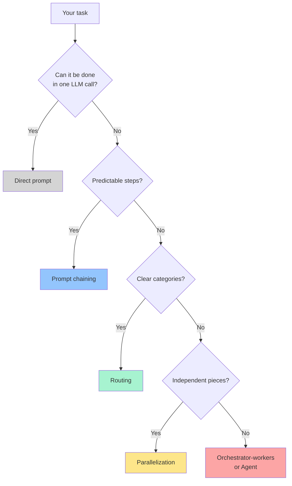

# Step 17 · Advanced Patterns

> **⏱️ Time:** ~3 hours · **Prereq:** Step 16

Once you've built the core loop, you graduate to *architecting* systems of agents. This step is the pattern language.

---

## 🎯 What you'll learn

- **10 battle-tested patterns** professionals use in production.
- When each pattern shines (and when it's overkill).
- References to canonical papers and implementations.

---

## The pattern catalog

Inspired by Anthropic's "Building Effective Agents" essay, OpenAI's Agents SDK docs, and the LangGraph playbook.



---

## Pattern 1 — Prompt chaining (the pipeline)

Decompose a task into fixed, sequential LLM calls.

```
Task → Step1(LLM) → Step2(LLM) → Step3(LLM) → Output
```

**Example:** *draft blog post → SEO-check & revise → translate → generate image prompts.*

**When to use:** steps are known and ordered.
**Pitfall:** errors propagate; add a gate (rubric check) between steps.

---

## Pattern 2 — Routing

A small classifier (LLM or rules) dispatches the input to a specialist.

```
Input → Router → { refund-agent | billing-agent | bug-agent }
```

**Example:** customer support routing to specialized assistants; code-reviewer-per-language.

**When to use:** distinct input categories with different handling.
**Pitfall:** train/test drift — users find inputs you didn't categorize.

---

## Pattern 3 — Parallelization

Same task, many LLMs, in parallel. Then aggregate.

Two flavors:
- **Sectioning** — split task into independent chunks, fan out, merge.
- **Voting** — run the same task N times, majority-vote the answer (for reliability).

**Example:** *"Scan every file for vulnerabilities"* → 1 subagent per file.
**When:** embarrassingly parallel tasks, or needing robustness.

---

## Pattern 4 — Orchestrator-workers

A **planner/orchestrator** decides dynamically what subagents to spawn. Workers execute. Orchestrator synthesizes.

```
Orchestrator: "This refactor needs 4 files changed"
  ├─ spawn Worker A on file 1
  ├─ spawn Worker B on file 2
  ├─ spawn Worker C on file 3
  ├─ spawn Worker D on file 4
  └─ synthesize results
```

**Example:** Claude Code's subagent delegation; Anthropic's multi-agent research system.
**When:** complex tasks where decomposition isn't predictable upfront.
**Pitfall:** orchestrator context can balloon; use Write+Compress (Step 13).

---

## Pattern 5 — Evaluator-optimizer (critique loop)

One LLM produces; another critiques; the first revises.

```
Producer ⇄ Critic  (loop until critic approves or N iterations)
```

**Example:** draft code → critic ("security issues?") → revise; translation → critic checks faithfulness → revise.
**When:** quality > speed; you have a clear eval rubric.
**Pitfall:** infinite loops; cap iterations, require a "confidence" threshold.

---

## Pattern 6 — Reflection

Agent re-reads its own output and decides what to improve. No separate critic model needed.

```
Agent produces answer → "now critique your answer" → revises
```

**When:** cheap quality bump for single-agent tasks.
**Pitfall:** models often can't see their own blind spots; evaluator-optimizer is stronger when it matters.

---

## Pattern 7 — Tool-augmented agent (ReAct)

The classic *reason ↔ act ↔ observe* loop you already built.

> Reason → Act → Observe → Reason → Act → Observe → …

Every modern coding agent is a ReAct agent under the hood.

**Reference paper:** [ReAct: Synergizing Reasoning and Acting in Language Models (2022)](https://arxiv.org/abs/2210.03629)

---

## Pattern 8 — Plan-and-execute

Two-phase version of ReAct:
1. **Planner** writes a complete plan upfront.
2. **Executor** runs the plan, perhaps with re-planning on failure.

**Example:** Aider's "architect mode"; Cursor's Plan mode + Agent mode combo.
**When:** complex tasks where upfront reasoning saves downstream loops.

---

## Pattern 9 — Multi-agent debate / swarm

Several agents with different roles (advocate / skeptic / judge) argue; consensus wins.

**Example:** "Is this PR ready?" → Senior/Junior/Security reviewer agents argue; Judge decides.

**When:** safety-critical or open-ended decisions.
**Pitfall:** expensive; only worth it when the problem's open-ended.

**Reference:** [Debate as a Safety Technique — OpenAI](https://openai.com/research/debate)

---

## Pattern 10 — Human-in-the-loop (HITL)

The agent pauses and asks for confirmation at defined checkpoints.

```
Agent planning → ⛔ pause for user "go?" → execute plan
```

**When:** destructive actions, high-cost tasks, newly deployed agents.
**Pitfall:** too many pauses → operator fatigue → rubber-stamping. Tune granularity.

---

## Production-style "agentic IDE" pattern

Combining patterns you'll see in Cursor/Claude Code:

```mermaid
flowchart LR
    User --> Plan[Plan mode<br/>(Plan-and-execute)]
    Plan --> Agent[Agent<br/>(ReAct w/ tools)]
    Agent -->|spawns| ExSA[Explore<br/>subagent]
    Agent -->|spawns| WorkSA[Worker<br/>subagent]
    Agent -->|produces| Draft
    Draft --> Review[Reviewer<br/>(Evaluator-optimizer)]
    Review --> PR[PR]
    Hooks[.hooks.json] -.->|gates| Agent
    Hooks -.->|gates| WorkSA
```

Recognize each pattern?

---

## The anti-pattern: "one mega-agent"

Most failed agent projects look like this: *one enormous prompt + 30 tools + unlimited context = chaos.*

Break it up. Prefer **many small, focused agents** orchestrated simply over **one big agent trying to do everything.**

---

## 🎥 Watch

- **[Anthropic — Building effective agents (talk)](https://www.youtube.com/results?search_query=anthropic+building+effective+agents)**
- **[LangChain — Multi-agent patterns](https://www.youtube.com/@LangChain)**
- **[AI Engineer Conference — multi-agent sessions](https://www.youtube.com/@aiengineerfoundation)**

## 📚 Read

- 📄 [**Anthropic — Building effective agents (essay)**](https://www.anthropic.com/research/building-effective-agents) — THE canonical read. Re-read it after every step.
- 📄 [**Anthropic — Multi-agent research system**](https://www.anthropic.com/research/multi-agent-research-system)
- 📄 [**ReAct paper**](https://arxiv.org/abs/2210.03629)
- 📘 [**LangGraph — Multi-agent concepts**](https://langchain-ai.github.io/langgraph/concepts/multi_agent/)
- 📘 [**OpenAI Agents SDK — Patterns**](https://github.com/openai/openai-agents-python)

---

## ✍️ Exercise (1 hour)

Take a real workflow you do weekly (e.g., "write a blog post + publish + share"), and **design it as a multi-agent system** using *at least three* patterns from this page.

1. Draw it with Mermaid (paste into the README of a new repo).
2. Name each agent, list its tools and rules/skills.
3. Decide which patterns: pipeline? routing? evaluator-optimizer?
4. Identify the HITL checkpoints.
5. Optionally: wire it up using Claude Code subagents or LangGraph.

Post the Mermaid diagram on Twitter/X. It's shareable catnip. `#AgenticCoding`.

---

## ✅ Self-check

1. When would you pick **orchestrator-workers** over **prompt chaining**?
2. What's the key tradeoff in **evaluator-optimizer**?
3. Why is "one mega-agent" often a smell?

---

## 🧭 Next

→ [Step 18 · Staying Current](./18-staying-current.md)
