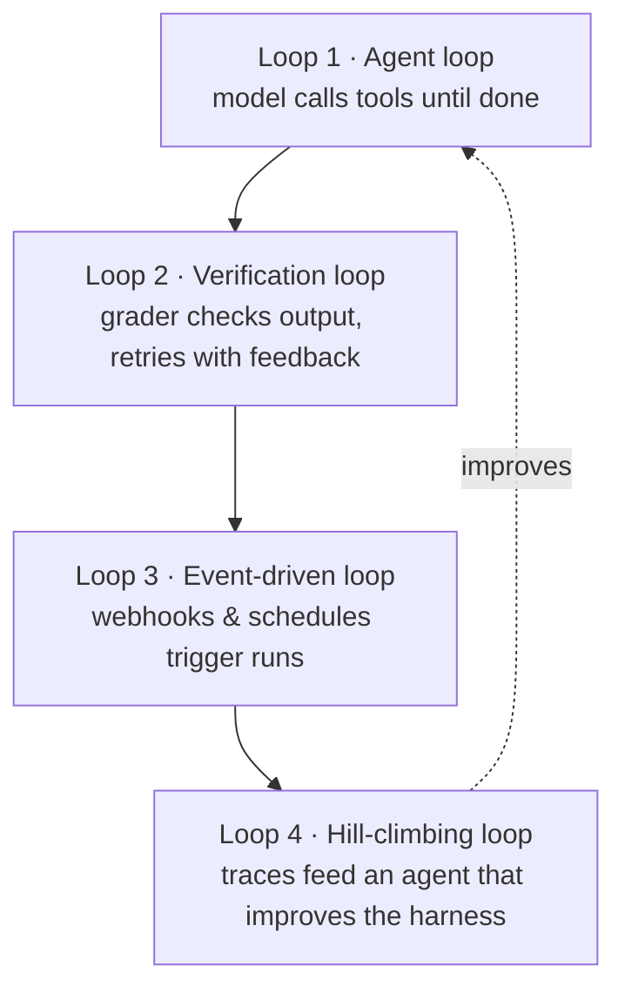
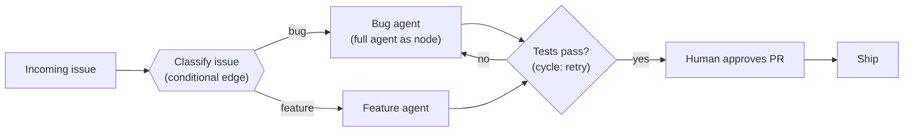

# Step 19 · Agent System Engineering

> **⏱️ Time:** ~2 hours · **Prereq:** Step 17

You can build an agent. You can wire five agents together. Now comes the meta-skill: **engineering the systems that run around the agent** — the loops it lives in, the graph it follows, the harness that holds it, and the job role that ships it. These are the "buzzword disciplines" of 2026, and each one is a real skill you can practice today.

---

## 🎯 What you'll learn

- **Loop engineering** — designing the cycles an agent runs in (and stopping them before they run forever).
- **Graph engineering** — drawing agent workflows as diagrams with fixed paths and model-chosen paths.
- **Harness engineering** — everything wrapped around the model: context, tools, memory, permissions.
- **Forward Deployed Engineer (FDE)** — an engineer who works at the customer's site; the hottest AI job of 2026.
- The plain-English meaning behind every buzzword (industry term + simple meaning).

---

## 1. The big picture (four terms, one idea)

All four terms describe the same realization from different angles: **the model is not the product — the system around the model is.** A good agent needs more than a clever prompt; it needs a well-built shell.

| Term | Plain meaning | What you already know |
|------|---------------|------------------------|
| **Loop engineering** | Designing the cycles (repeated rounds) an agent runs in, plus rules to end them. | Step 16 — the `while not done` loop |
| **Graph engineering** | Drawing the agent's workflow as a diagram of steps (nodes) and connections (edges). | Step 17 — the pattern catalog |
| **Harness engineering** | Building the whole shell around the model: context, tools, memory, permissions. | Steps 07–13 — rules, skills, MCP, context |
| **FDE (forward deployed engineer)** | An engineer embedded at a customer's company to build and ship AI solutions there. | This whole roadmap is the skill set |

> "The potential in agents is in the loops you build around them." — LangChain, *The Art of Loop Engineering*

---

## 2. Loop engineering

### The 4 stacked loops

Your Step 16 agent is **Loop 1**. Production agents wrap that loop in more loops. Each outer loop makes the inner one better or safer:

- **Loop 1 — Agent loop (you built this):** model → pick tool → run → observe → repeat until done.
- **Loop 2 — Verification loop:** after the agent finishes, a **grader** (a checker: code tests, an LLM-as-judge) scores the output against a rubric. If it fails, the result goes back with feedback and the agent tries again. **This is Step 14's evals, wrapped around a running agent.**
- **Loop 3 — Event-driven loop:** instead of a human typing a prompt, an event starts the agent: a new GitHub issue, a Slack message, a cron schedule (a timer that fires at set times). **This is Step 11's hooks and automation, at production scale.**
- **Loop 4 — Hill-climbing loop:** every run produces a **trace** (a step-by-step record). An analysis agent reads many traces, finds what's failing, and rewrites the prompt, tool, or grader config. Each cycle "climbs the hill" — gets measurably better. This is how "the agent improves itself."

### Guardrails (stop rules) — the part beginners forget

An agentic loop is a **trigger + a verifiable goal**. Without a stop rule, a loop runs forever, burns money, and makes things worse. Always define:

1. **Max iterations** (e.g., `max_steps = 6` in your Step 16 agent).
2. **A success condition** — a test or rubric that means "done."
3. **A budget** — max tokens, max cost, max wall-clock time.
4. **An approval gate** (HITL — human-in-the-loop, a person approves risky steps) for destructive actions.

> **Rule of thumb:** if you can't write the stop condition in one sentence, you aren't ready to run the loop unattended.

---

## 3. Graph engineering

### Nodes, edges, and state

A **graph** (a diagram of connected steps) is a way to control *where* the model gets to decide and where your code enforces the path:

- **Node** — one unit of work: fixed code, a single LLM call, or even a whole agent with its own internal loop.
- **Edge** — "what happens next." Some edges are fixed; some are **conditional** (a router decides at runtime).
- **State** — the data that flows along the edges (messages, files, flags).

### The two rules of graph engineering

1. **A loop is just a simple graph.** Loop engineering and graph engineering are the same skill at different sizes. A cycle (going back to retry a failed tool call, pausing for a human) is a normal part of a production graph — production graphs are **not** one-way flows (DAGs — directed acyclic graphs, diagrams where arrows never loop back).
2. **Put determinism (fixed behavior) where you know the answer; put the model where you don't.** A support flow *should* always classify before routing. A deep-research flow *should not* — the plan is too unpredictable, so let a free agent loop handle it.

### When to use a graph vs. a free agent

| Use a graph when… | Use a free agent loop when… |
|---|---|
| The workflow has predictable stages (classify → search → synthesize) | The task is open-ended (deep research, novel feature work) |
| You need compliance/approvals at fixed points | Every run looks different |
| Reliability matters more than flexibility | Flexibility matters more than predictability |

**Tie-in:** Step 17's prompt chaining and routing *are* tiny graphs. LangGraph (Step 17's framework table) is the most popular tool for building them.

---

## 4. Harness engineering

The **harness** is the whole shell around the model — everything the model sees and touches but doesn't write itself:

- **Context** (Step 13): what you put in, what you leave out, what you compress.
- **Tools** (Step 10): the MCP servers and functions the agent may call.
- **Memory** (Step 07): rules files, skills, session history.
- **Permissions** (Step 15): what the agent may *not* do (denylists, approvals, sandboxes).

A great model in a bad harness underperforms a decent model in a great harness. When your agent misbehaves, the fix is usually in the harness, not the model — change the context, trim a tool, tighten a permission.

> **Plain-English anchor:** the model is the engine; the harness is the car — steering, brakes, fuel, and seatbelt.

---

## 5. Forward Deployed Engineer (FDE)

### What it is

An **FDE (forward deployed engineer)** is a software engineer who works *at the customer's company* for weeks or months, building and deploying the vendor's product inside the customer's systems. The term was popularized by **Palantir**, and in 2025–2026 it became one of the hottest jobs in AI: OpenAI, Anthropic, AWS, and Google all hire FDEs to embed with customers using their AI products.

### Why it's hot in the agent era

AI products are not "install and done." They need integration with the customer's data, workflows, and security policies — and they need someone who can iterate on the spot (adjust prompts, wire MCP servers, fix evals). That's exactly an FDE's job: **the bridge between "the AI can do it" and "the AI does it here."**

### The roadmap-to-FDE skill map

You already have most of the toolkit:

| FDE skill | Where you learned it |
|---|---|
| Plug into any system | Step 10 — building MCP servers |
| Make agent output trustworthy | Step 14 — evals |
| Understand what the model sees | Step 13 — context engineering |
| Keep it safe | Step 15 — security & threat models |
| Ship fast, iterate in public | Steps 04–06 + your capstone |
| Talk to non-technical users | The plain-English habit you've been practicing all along |

**Not in the roadmap (and that's fine):** travel, customer politics, and saying "let me check" in a meeting without sweating. Those you learn on the job.

---

## 6. Buzzwords you'll hear (plain meanings)

- **Loopcraft:** the craft of stacking loops (swyx's word for loop engineering).
- **Cognitive architecture:** the fixed structure of an agent system (the graph, the memory, the loop) — the "brain wiring" you design, as opposed to the model.
- **LLM-as-judge:** using one LLM to grade another LLM's output (a common grader in the verification loop).
- **Compaction:** squeezing the conversation history into a shorter summary so a long agent run fits the context window.
- **Deep agents:** agents that run long tasks autonomously, retrying and self-correcting — powered by the loops above.

---

## 🎥 Watch

- **[Latent Space — "loopcraft: the art of stacking loops" (swyx)](https://www.latent.space/p/ainews-loopcraft-the-art-of-stacking)** — the essay that named the skill.
- **[LangChain YouTube](https://www.youtube.com/@LangChain)** — loop and graph engineering talks.

## 📚 Read

- 📄 [**LangChain — The Art of Loop Engineering**](https://www.langchain.com/blog/the-art-of-loop-engineering) — the 4-loop stack, clearly explained.
- 📄 [**LangChain — 3 Years of Graph Engineering with LangGraph**](https://www.langchain.com/blog/3-years-of-graph-engineering-with-langgraph) — when to use graphs and when not to.
- 📄 [**The New Stack — FDE is AI's hottest job**](https://thenewstack.io/forward-deployed-engineer-fde-openai-google/) — what FDEs do and how to become one.
- 📘 [**LangGraph docs — Graph API**](https://docs.langchain.com/oss/python/langgraph/graph-api) — nodes, edges, and state, hands-on.

---

## ✍️ Exercise (1 hour)

1. **Stack two loops around your Step 16 agent.** Add a verification loop (a simple grader: run tests, or a checklist LLM-as-judge) that sends failing output back for one retry. Add a stop budget (`max_steps` + a cost limit). Run it on a task that fails once — watch it self-correct.
2. **Draw your workflow as a graph.** Take one real task (e.g., "triage a bug report"). Draw it in Mermaid with at least: one conditional edge, one cycle (retry), one HITL pause. Label which nodes are fixed code and which are LLM calls.
3. **Decide: graph or loop?** For your task, explain in two sentences why you'd pick one over the other.
4. **Career check:** read the FDE article. List two skills from this roadmap you'd polish first if you wanted that role.

Post your Mermaid diagram on Twitter/X, LinkedIn, or GitHub with `#AgenticCoding`.

---

## ✅ Self-check

1. What are the 4 stacked loops, and which one does your Step 16 agent already implement?
2. What's the difference between a node and an edge? Give one example of each.
3. Why does a production graph often contain cycles (arrows that point back)?
4. Name the 4 parts of a harness. Which one caused your last "bad agent" moment?
5. In one sentence, what does an FDE actually do?

---

## 🧭 Next

→ [Step 18 · Staying Current](./18-staying-current.md) — then you're done. The disciplines in this step are *exactly* what the "staying current" cadence exists to track.
